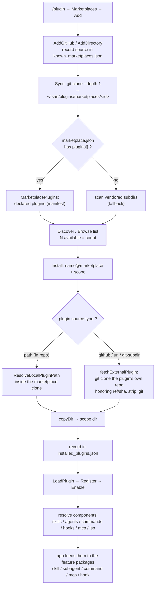

# plugin

> 中文版本：[`plugin.zh.md`](plugin.zh.md)

Plugin loader, installer, marketplace, and aggregator. A plugin is a
single package (directory) that may contribute skills, subagent
definitions, slash commands, MCP servers, hooks, and env vars — this
package discovers them, enables/disables them, and exposes their
contributions to the consuming feature packages.

## Purpose

San's "everything else" extension surface. Plugins are how a user
installs a bundle of skills + agents + commands + MCP servers + hooks in
one shot. This package handles install/uninstall, marketplace lookup,
load order, and the cross-cutting callbacks that let `skill`, `subagent`,
`command`, `mcp`, `hook`, and `setting` see what each enabled plugin
contributes without importing `plugin` directly.

## Contract

The package exposes `*Registry` directly plus package-level free
functions for the cross-domain integration surface. No producer-side
interface — each downstream consumer (skill / subagent / command / mcp
/ setting) pulls a different small set of free functions, so a unified
interface would just collect unrelated methods.

```go
package plugin

// Registry is the opaque handle to the loaded plugin set plus per-scope
// enabled state. Type exported, fields unexported.
type Registry struct { /* internal fields */ }

// Loading
func (r *Registry) Load(ctx context.Context, cwd string) error
func (r *Registry) LoadFromPath(ctx context.Context, path string) error
func (r *Registry) LoadClaudePlugins(ctx context.Context) error

// Query
func (r *Registry) Get(name string) (*Plugin, bool)
func (r *Registry) List() []*Plugin
func (r *Registry) GetEnabled() []*Plugin
func (r *Registry) Count() int
func (r *Registry) EnabledCount() int
func (r *Registry) GetByScope(scope Scope) []*Plugin

// Mutation
func (r *Registry) Enable(name string, scope Scope) error
func (r *Registry) Disable(name string, scope Scope) error
func (r *Registry) Register(p *Plugin)
func (r *Registry) Unregister(name string)

// Installer construction (package-level free function)
func NewInstaller(reg *Registry, cwd string) *Installer

// Cross-domain integration (package-level free functions; read from
// the package-level default registry). Each consumer that needs
// plugin-contributed data imports plugin and calls one of these:
func GetPluginAgentPaths() []PluginPath
func GetPluginSkillPaths() []PluginPath
func GetPluginCommandPaths() []PluginPath
func GetPluginMCPServers() []PluginMCPServer
func GetPluginHooks() map[string][]setting.Hook
func PluginEnv() []string

// Plugin root tracking (process-global state; package-level functions)
func SetActivePluginRoot(path string)
func ClearActivePluginRoot()
func FindPluginRootForPath(path string) string

// Package-level access
func Initialize(ctx context.Context, opts Options) error
func Default() *Registry
func SetDefaultRegistry(r *Registry)  // test-only
func ResetDefaultRegistry()           // test-only
```

## Internals

- `Registry` (`registry.go`) — `Plugin` map keyed by name, enable state
  per scope (user / project).
- `loader.go` — discovers `.san/plugins/`, `~/.san/plugins/`,
  `.claude/plugins/`, `~/.claude/plugins/`.
- `installer.go` — install/uninstall logic, dependency check, version
  pin (~13 KB).
- `marketplace.go` — registry-of-registries lookup (where to find
  plugin sources).
- `resolver.go` — name → install spec resolution.
- `integration.go` — the cross-domain callback wiring.

## Lifecycle

- Construction: `Initialize(ctx, Options{CWD})` is one of the first
  `Initialize` calls because every feature package's `Initialize`
  pulls `plugin.*Paths()`.
- Reload: enabling/disabling a plugin triggers a reload of the
  affected feature packages (commands/skills/subagents/MCP).

## Marketplace & install flow

A marketplace is a catalog. Its `marketplace.json` *declares* plugins;
each plugin's `source` says where its content actually lives — a path
inside the marketplace repo, or its own external repo (Claude Code's
model). "N available" is the count of declared plugins, independent of
what is cloned on disk.



**Plugin `source` formats** (in `marketplace.json` `plugins[]`):

| Form | Example | Content fetched from |
|------|---------|----------------------|
| relative path (string) | `"./plugins/foo"` | a directory inside the marketplace repo |
| `github` | `{"source":"github","repo":"owner/repo","ref?":"","sha?":""}` | that GitHub repo |
| `url` (alias `git`) | `{"source":"url","url":"https://host/p.git","ref?":""}` | that git repo (any host) |
| `git-subdir` | `{"source":"git-subdir","url":"…","path":"sub/dir"}` | a subdirectory of that repo |
| `npm` | `{"source":"npm","package":"@scope/p"}` | npm (parsed; install not yet supported) |

**Scope → install dir:** user → `~/.san/plugins/cache/`, project →
`.san/plugins/`, local → `.san/plugins-local/`. Enable state lives in
the scope's `settings.json` under `enabledPlugins`.

## Tests

```
internal/plugin/plugin_test.go              — large suite covering load /
                                              install / enable / contributions.
internal/plugin/marketplace_manifest_test.go — manifest source parsing,
                                              available listing, path install.
```

## See Also

- Code: `internal/plugin/`
- Consumers: [`packages/skill.md`](skill.md), [`packages/subagent.md`](subagent.md), [`packages/command.md`](command.md), [`packages/mcp.md`](mcp.md), [`packages/hook.md`](hook.md), [`packages/setting.md`](setting.md)
- Concepts: [`concepts/extension-model.md`](../../concepts/extension-model.md)
- Layer: `feature`
