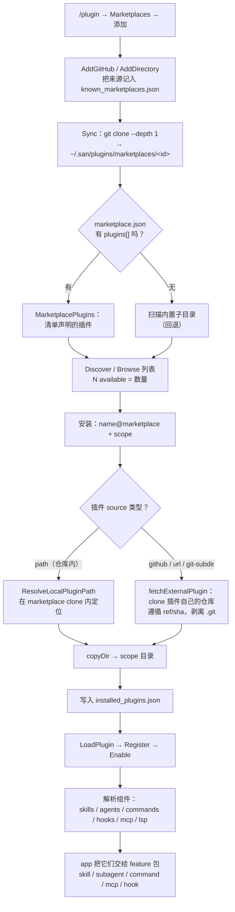

# plugin

> English version: [`plugin.md`](plugin.md)

插件的加载器、安装器、marketplace 和聚合器。一个插件就是一个包（目录），
它可以贡献 skills、subagent 定义、斜杠命令、MCP servers、hooks 和环境
变量——本包负责发现它们、启用/禁用它们，并把它们的贡献暴露给上层的
feature 包。

## 用途

San 的"其余一切"扩展面。插件让用户一次性安装一整套 skills + agents +
commands + MCP servers + hooks。本包处理安装/卸载、marketplace 查找、
加载顺序，以及那些跨切面的回调——让 `skill`、`subagent`、`command`、
`mcp`、`hook`、`setting` 无需直接 import `plugin` 就能看到每个已启用插件
贡献了什么。

## 契约

本包直接暴露 `*Registry`，外加一组包级自由函数作为跨域集成面。没有
生产者侧的接口——每个下游消费者（skill / subagent / command / mcp /
setting）各自取用一小撮不同的自由函数，统一成一个接口只会把互不相关的
方法凑到一起。

```go
package plugin

// Registry 是已加载插件集合 + 各 scope 启用状态的不透明句柄。
// 类型导出，字段不导出。
type Registry struct { /* 内部字段 */ }

// 加载
func (r *Registry) Load(ctx context.Context, cwd string) error
func (r *Registry) LoadFromPath(ctx context.Context, path string) error
func (r *Registry) LoadClaudePlugins(ctx context.Context) error

// 查询
func (r *Registry) Get(name string) (*Plugin, bool)
func (r *Registry) List() []*Plugin
func (r *Registry) GetEnabled() []*Plugin
func (r *Registry) Count() int
func (r *Registry) EnabledCount() int
func (r *Registry) GetByScope(scope Scope) []*Plugin

// 变更
func (r *Registry) Enable(name string, scope Scope) error
func (r *Registry) Disable(name string, scope Scope) error
func (r *Registry) Register(p *Plugin)
func (r *Registry) Unregister(name string)

// 构造 Installer（包级自由函数）
func NewInstaller(reg *Registry, cwd string) *Installer

// 跨域集成（包级自由函数；从包级默认 registry 读取）。
// 每个需要插件贡献数据的消费者 import plugin 并调用其中之一：
func GetPluginAgentPaths() []PluginPath
func GetPluginSkillPaths() []PluginPath
func GetPluginCommandPaths() []PluginPath
func GetPluginMCPServers() []PluginMCPServer
func GetPluginHooks() map[string][]setting.Hook
func PluginEnv() []string

// 插件根目录追踪（进程级全局状态；包级函数）
func SetActivePluginRoot(path string)
func ClearActivePluginRoot()
func FindPluginRootForPath(path string) string

// 包级访问
func Initialize(ctx context.Context, opts Options) error
func Default() *Registry
func SetDefaultRegistry(r *Registry)  // 仅测试
func ResetDefaultRegistry()           // 仅测试
```

## 内部实现

- `Registry`（`registry.go`）——以 name 为键的 `Plugin` map，按 scope
  （user / project）保存启用状态。
- `loader.go`——发现 `.san/plugins/`、`~/.san/plugins/`、
  `.claude/plugins/`、`~/.claude/plugins/`。
- `installer.go`——安装/卸载逻辑、依赖检查、版本固定（~13 KB）。
- `marketplace.go`——registry-of-registries 查找（去哪里找插件来源）。
- `resolver.go`——name → 安装规格 的解析。
- `integration.go`——跨域回调的接线。

## 生命周期

- 构造：`Initialize(ctx, Options{CWD})` 是最早一批 `Initialize` 调用之一，
  因为每个 feature 包的 `Initialize` 都会拉 `plugin.*Paths()`。
- 重载：启用/禁用一个插件会触发受影响 feature 包
  （commands/skills/subagents/MCP）的重载。

## Marketplace 与安装流程

marketplace 是一个目录册。它的 `marketplace.json` *声明*插件；每个插件的
`source` 说明其内容真正在哪——可能是 marketplace 仓库内的一个路径，也可能
是插件自己的外部仓库（Claude Code 的模型）。"N available" 是被声明插件的
数量，与磁盘上 clone 了什么无关。



**插件 `source` 格式**（位于 `marketplace.json` 的 `plugins[]`）：

| 形式 | 示例 | 内容来源 |
|------|------|----------|
| 相对路径（字符串） | `"./plugins/foo"` | marketplace 仓库内的一个目录 |
| `github` | `{"source":"github","repo":"owner/repo","ref?":"","sha?":""}` | 该 GitHub 仓库 |
| `url`（别名 `git`） | `{"source":"url","url":"https://host/p.git","ref?":""}` | 该 git 仓库（任意 host） |
| `git-subdir` | `{"source":"git-subdir","url":"…","path":"sub/dir"}` | 该仓库的一个子目录 |
| `npm` | `{"source":"npm","package":"@scope/p"}` | npm（可解析；暂不支持安装） |

**scope → 安装目录：** user → `~/.san/plugins/cache/`，project →
`.san/plugins/`，local → `.san/plugins-local/`。启用状态保存在对应 scope
的 `settings.json` 的 `enabledPlugins` 字段下。

## 测试

```
internal/plugin/plugin_test.go              — 覆盖加载 / 安装 / 启用 /
                                              贡献的大型测试套件。
internal/plugin/marketplace_manifest_test.go — 清单 source 解析、
                                              available 列表、path 安装。
```

## 另见

- 代码：`internal/plugin/`
- 消费者：[`packages/skill.md`](skill.md)、[`packages/subagent.md`](subagent.md)、[`packages/command.md`](command.md)、[`packages/mcp.md`](mcp.md)、[`packages/hook.md`](hook.md)、[`packages/setting.md`](setting.md)
- 概念：[`concepts/extension-model.md`](../../concepts/extension-model.md)
- 层级：`feature`
